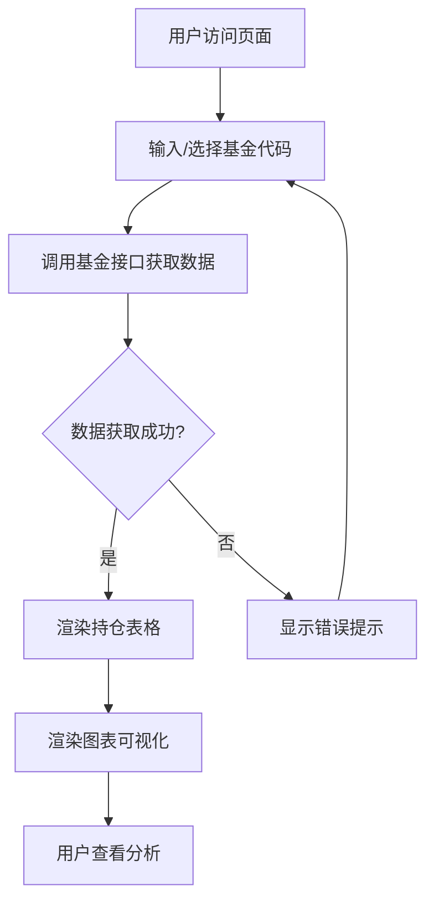

# 产品需求文档 (PRD)

## 1. 产品概述
这是一个基金持仓信息展示系统，旨在为用户提供实时、清晰的基金持仓数据可视化服务。
- 主要目的：帮助用户快速了解基金的最新持仓情况，包括股票、债券等资产配置
- 目标用户：投资者、基金持有人、金融分析师等关注基金持仓的用户

## 2. 核心功能

### 2.1 功能模块
1. **基金持仓页面**：基金选择、持仓数据展示、图表可视化

### 2.2 页面详情
| 页面名称 | 模块名称 | 功能描述 |
|---------|---------|---------|
| 基金持仓页面 | 基金选择器 | 支持用户输入基金代码或选择预设基金 |
| 基金持仓页面 | 数据展示区 | 以表格形式展示持仓详情（股票名称、持仓比例、持仓市值等） |
| 基金持仓页面 | 图表可视化 | 使用饼图/柱状图展示持仓分布、行业分布等 |
| 基金持仓页面 | 基金基本信息 | 显示基金名称、类型、规模等基础信息 |

## 3. 核心流程
用户访问页面 → 输入/选择基金代码 → 调用基金接口获取数据 → 渲染表格和图表 → 用户查看分析持仓信息

## 4. 用户界面设计

### 4.1 设计风格
- **主色调**：金融蓝 (#2563eb) + 专业灰 (#64748b)
- **辅助色**：上涨绿 (#10b981)、下跌红 (#ef4444)
- **按钮样式**：圆角设计，hover 时有微妙的阴影提升
- **字体**：
  - 标题：使用系统默认无衬线字体，粗体，大小 24-32px
  - 正文：微软雅黑/系统默认，大小 14-16px
- **布局风格**：顶部导航 + 卡片式内容区域，响应式设计
- **图标风格**：简洁的线性图标，搭配适当的图标增强可读性

### 4.2 页面设计概览
| 页面名称 | 模块名称 | UI 元素 |
|---------|---------|---------|
| 基金持仓页面 | 基金选择器 | 输入框 + 查询按钮，居中布局 |
| 基金持仓页面 | 数据展示区 | 表格：交替行背景色，固定表头，响应式列宽 |
| 基金持仓页面 | 图表可视化 | 饼图（持仓比例）+ 柱状图（行业分布），左右并排或上下排列 |
| 基金持仓页面 | 基金基本信息 | 卡片式设计，信息标签化展示 |

### 4.3 响应式设计
- 桌面优先设计，最小宽度 1200px
- 移动端自适应：表格转为卡片列表，图表改为单列布局
- 触摸优化：按钮足够大，表格支持横向滚动

### 4.4 交互细节
- 加载状态：显示骨架屏或加载动画
- 错误处理：友好的错误提示，提供重试按钮
- 数据更新：支持手动刷新获取最新数据