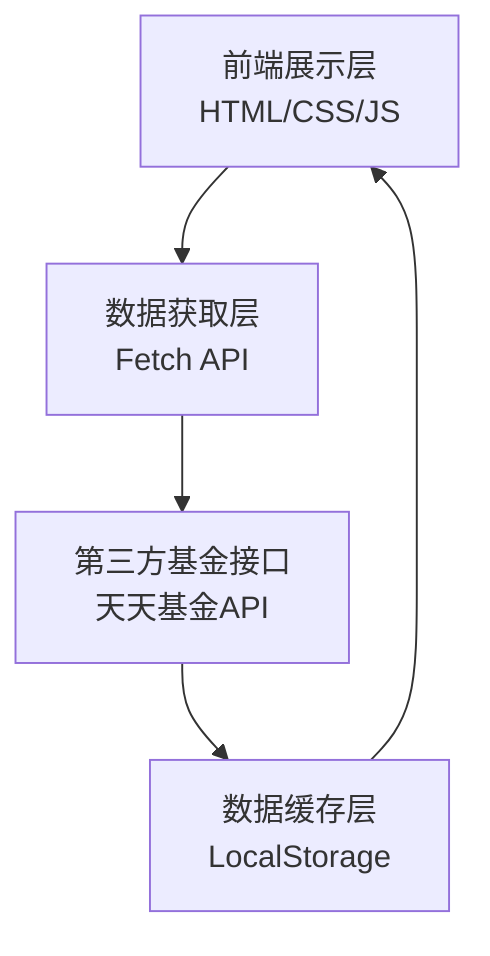

# 技术架构文档

## 1. 架构设计



## 2. 技术说明
- **前端**：原生 HTML5 + CSS3 + JavaScript (ES6+)
- **图表库**：ECharts 5.x (通过 CDN 引入)
- **样式方案**：原生 CSS Grid + Flexbox 布局
- **数据源**：天天基金网公开 API (或类似基金数据接口)
- **构建工具**：无构建工具，直接使用浏览器运行

## 3. 路由定义
| 路由 | 用途 |
|------|------|
| / 或 /index.html | 基金持仓信息展示页面（单页应用） |

## 4. API 接口定义

### 4.1 使用的外部接口
**天天基金网 API** (示例接口)
- **获取基金基本信息**：
  - 接口：`https://fundgz.1234567.com.cn/js/{基金代码}.js`
  - 方法：GET
  - 参数：基金代码（如：000001）
  - 返回：JSONP 格式的基金实时估值数据

- **获取基金持仓明细**：
  - 接口：`https://fundf10.eastmoney.com/FundArchivesDataURL/{基金代码}.html`
  - 方法：GET
  - 参数：基金代码
  - 返回：HTML 页面（需要解析）

### 4.2 数据结构定义
```javascript
// 基金基本信息
interface FundInfo {
  code: string;          // 基金代码
  name: string;          // 基金名称
  type: string;          // 基金类型
  scale: number;         // 基金规模（亿元）
  manager: string;       // 基金经理
  company: string;       // 基金公司
}

// 持仓股票信息
interface StockHolding {
  stockCode: string;     // 股票代码
  stockName: string;     // 股票名称
  ratio: number;         // 持仓比例（%）
  amount: number;        // 持仓市值（万元）
  shares: number;        // 持仓股数（万股）
  change: string;        |// 变动情况
}

// 持仓数据
interface FundHolding {
  fundInfo: FundInfo;           // 基金基本信息
  stockList: StockHolding[];    // 股票持仓列表
  bondList?: BondHolding[];     // 债券持仓列表（可选）
  updateTime: string;           // 数据更新时间
}
```

## 5. 项目结构
```
基金持仓/
├── index.html           # 主页面
├── css/
│   └── style.css        # 样式文件（可选，可内联）
├── js/
│   └── app.js           # 主逻辑文件（可选，可内联）
└── .trae/
    └── documents/       # 文档目录
```

## 6. 核心功能实现方案

### 6.1 数据获取
- 使用 Fetch API 调用第三方基金接口
- 处理跨域问题：使用 JSONP 或 CORS 代理
- 错误处理：网络异常、接口返回错误的友好提示

### 6.2 数据缓存
- 使用 LocalStorage 缓存基金代码和基本信息
- 缓存策略：24小时有效，避免频繁请求

### 6.3 图表渲染
- 使用 ECharts 渲染饼图（持仓比例）和柱状图（行业分布）
- 响应式图表：监听窗口大小变化，自动调整图表尺寸

### 6.4 表格渲染
- 动态生成表格数据
- 支持排序功能（按持仓比例排序）
- 交替行背景色，提升可读性

## 7. 性能优化
- 按需加载：只在用户查询时才请求接口
- 图表懒加载：页面滚动到图表区域时再初始化
- 资源压缩：内联 CSS 和 JS，减少 HTTP 请求
- CDN 加速：使用 CDN 加载 ECharts 库

## 8. 兼容性
- 浏览器兼容：Chrome 80+, Edge 80+, Firefox 75+, Safari 13+
- 移动端兼容：iOS Safari, Chrome for Android
- 降级方案：在不支持 ES6 的浏览器显示提示信息